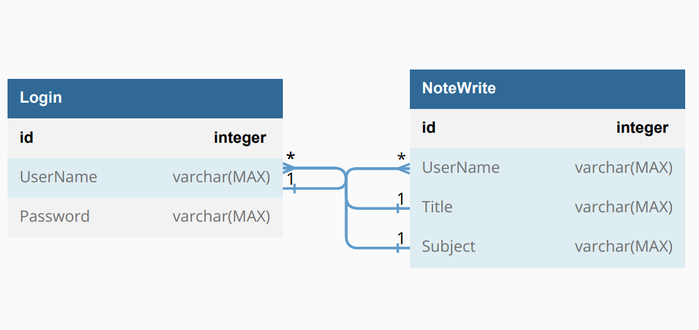

# Note Book App

## About
>Since I have to take notes and I have work to do,
>I decided to make an application that will make it easier for users who want to use it as well as take notes.

## Features
>taking and writing important notes or daily notes,
It is saved in your account and you can add and change New Notes at any time.

# Database-Diagram

## Release
* **0.1.0**

## Tools Used 
* Guna Framework

## Languages
* English
